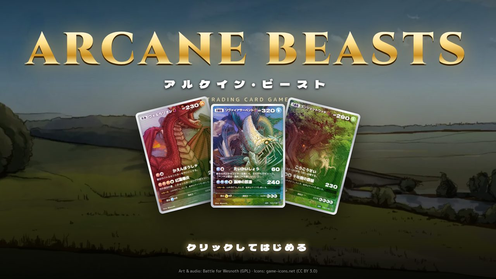
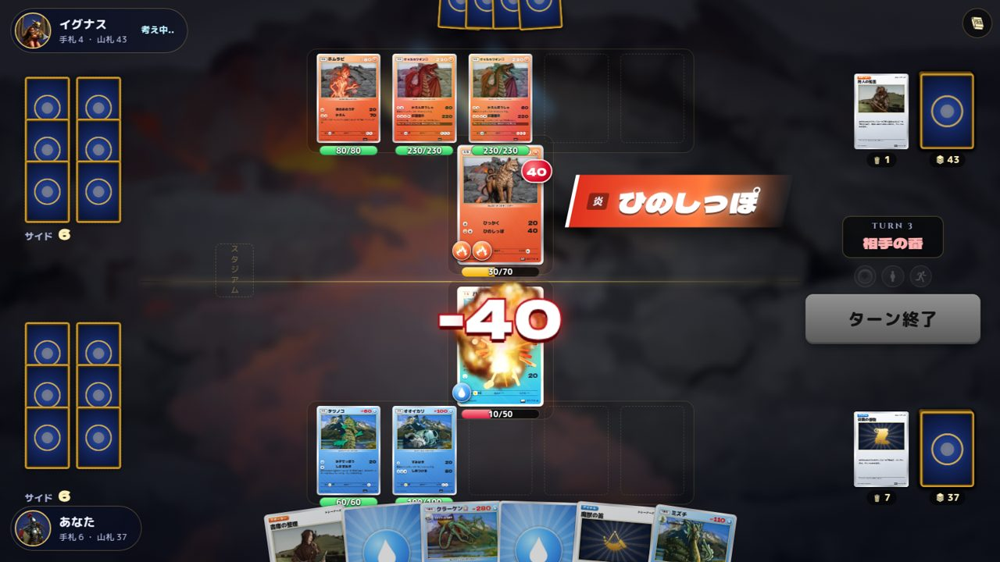
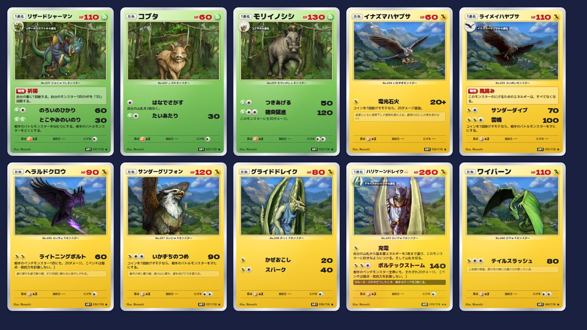
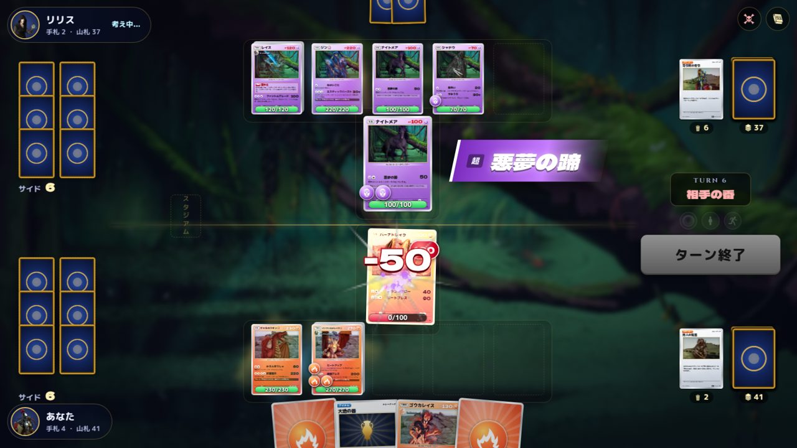
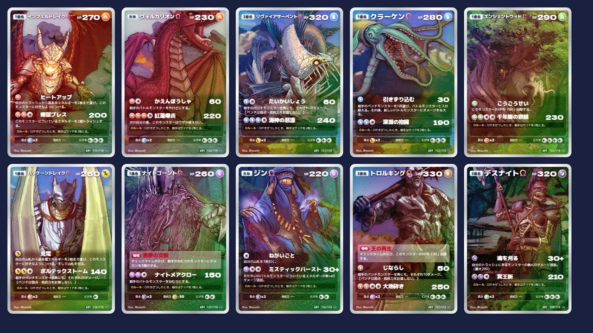
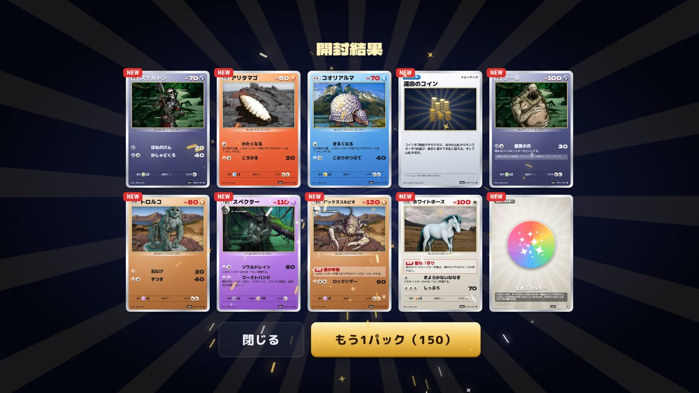
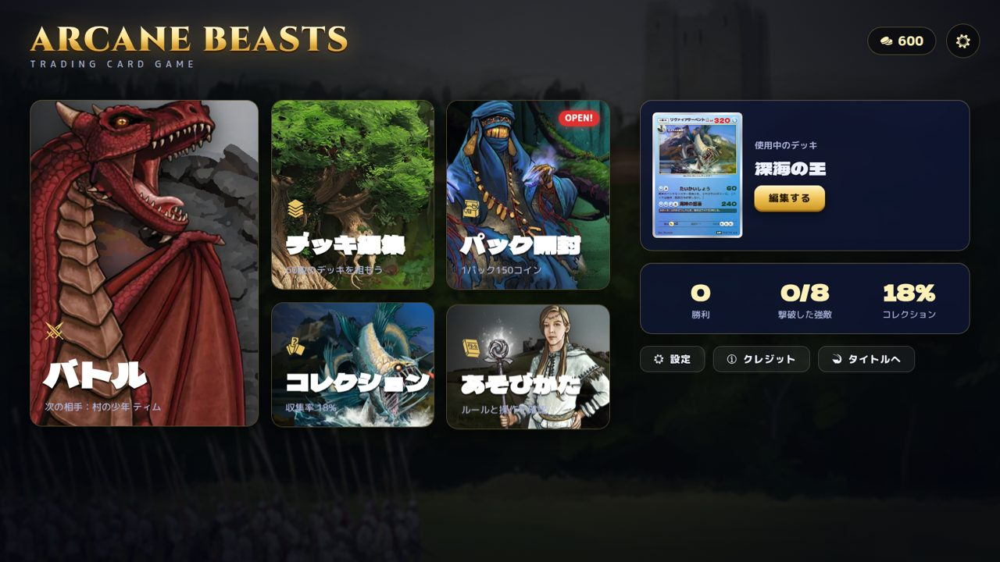
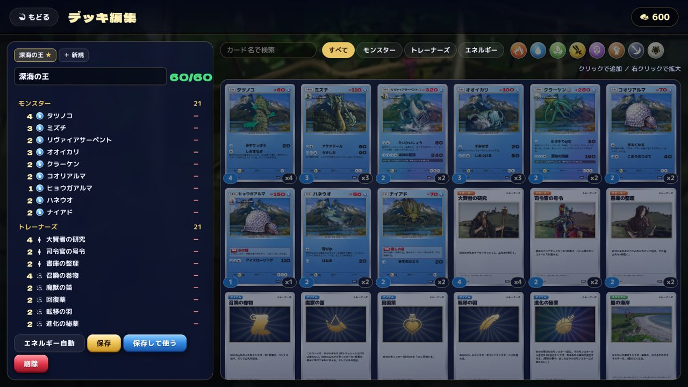

# ARCANE BEASTS — アルケイン・ビースト

ブラウザで遊べる、本格派のモンスター・トレーディングカードゲームです。
60枚デッキ・サイド6枚・進化・エネルギー・特殊状態といった王道のルールを完全に自動処理し、CPU と対戦できます。
イラスト・効果音・BGM は、ほぼすべてオープンソースの外部素材（Battle for Wesnoth ほか）で作られています。



| バトル | カード |
| --- | --- |
|  |  |
|  |  |

| パック開封 | ホーム | デッキ編集 |
| --- | --- | --- |
|  |  |  |

## 特徴

- **ルールエンジン**：60枚デッキ、先攻・後攻、マリガン、サイド6枚、ベンチ5匹、1進化／2進化、エネルギー（1ターン1枚）、サポーター（1ターン1枚）、スタジアム、どうぐ、特性、にげる、弱点×2、抵抗力-30、どく／やけど／ねむり／マヒ／こんらん、チェックタイム、Ω（きぜつでサイド2枚）、山札切れ・場のモンスター全滅による勝敗
- **139種のカード**：オリジナルのモンスター70種、トレーナーズ30種、エネルギー9種、フルアート（SR）とゴールド（UR）のシークレットレア
- **CPU 対戦**：合法手ごとに盤面を1手先までシミュレーションして選ぶ AI。3段階の難易度、8人の強敵（ストーリー）、フリー対戦、CPU 同士の観戦モード
- **演出**：カードが実際に移動する FLIP アニメーション、タイプ別エフェクト（スプライト + パーティクル）、ダメージ数字、画面揺れ、3D コイントス、ターンバナー、ホロ加工（マウス追従のチルト + 虹色の光沢）
- **コレクション**：パック開封（レア度演出つき）、デッキ構築（所持枚数・4枚制限・自動エネルギー）、図鑑、コイン報酬、セーブデータ（localStorage）

## オンライン対戦

自宅PCで専用サーバー（`npm run server`）を動かし、Cloudflare Tunnel で公開すると、QRコードで友達を招待して対戦できます。
フレンド対戦・ランダムマッチ・オンラインランク・観戦に対応。手順は **[docs/ONLINE.md](docs/ONLINE.md)**、Windows 用の起動ファイルは `online/` にあります。

## 遊び方

```bash
npm install
npm run dev      # http://localhost:5173
npm run build    # dist/ に静的サイトを出力
npm test         # ルールエンジンのテスト（CPU 同士の全デッキ総当たり対戦を含む）
```

`main` ブランチに push すると GitHub Actions が GitHub Pages にデプロイします（リポジトリ設定の Pages で「GitHub Actions」を選択してください）。公開の手順は [docs/PUBLISH.md](docs/PUBLISH.md) を参照。

開発用 URL パラメータ：

- `?battle&me=fire&vs=ignis` … デッキと相手を指定して即対戦
- `?battle&auto&speed=2` … CPU 同士の観戦
- `?gallery&from=0&n=12&w=260` … カード一覧

## 構成

```
src/
  engine/        ルールエンジン（純粋な TypeScript。UI に依存しない）
    game.ts      対戦全体を1本のコルーチン（generator）として実装。選択はすべて Prompt
    ai.ts        CPU（シミュレーション + ヒューリスティック）
    cards/       カード定義（効果はデータ駆動。テキストは効果定義から自動生成）
    decks.ts     構築済みデッキ・強敵
  battle/        対戦画面：コントローラー（フレーム再生）、盤面、演出、パーティクル
  screens/       タイトル／ホーム／バトル選択／デッキ編集／コレクション／パック開封 ほか
  ui/            カード描画（コンテナクエリ単位で任意サイズに対応）、アイコン
  audio/         BGM・効果音（Howler）とカードの合成音（WebAudio）
scripts/
  build_assets.py  外部素材を取得済みの Wesnoth から変換（WebP 化、スプライトシート化、MP3 化、クレジット生成）
```

素材を作り直す場合は、Wesnoth を部分 clone してから変換スクリプトを実行します：

```bash
git clone --depth 1 --filter=blob:none --sparse https://github.com/wesnoth/wesnoth ../wesnoth
git -C ../wesnoth sparse-checkout set data/core/images/portraits data/core/images/story \
  data/core/images/halo data/core/images/projectiles data/core/music data/core/sounds sounds
pip install pillow imageio-ffmpeg
python3 scripts/build_assets.py ../wesnoth
```

## クレジットとライセンス

- ポートレート・背景・エフェクト・効果音・BGM：[Battle for Wesnoth](https://www.wesnoth.org/)（GNU GPL v2 以降／一部 CC BY-SA 4.0）。ファイルごとの作者とライセンスは [CREDITS.md](CREDITS.md)
- アイコン：[game-icons.net](https://game-icons.net/)（CC BY 3.0）
- フォント：Dela Gothic One、M PLUS Rounded 1c、M PLUS 1p、Cinzel（SIL OFL 1.1）

GPL の素材を含むため、本作全体を **GNU GPL v2 以降** で配布します（[LICENSE](LICENSE)）。
カード名・テキスト・ゲームデザインはすべて本作オリジナルです。
